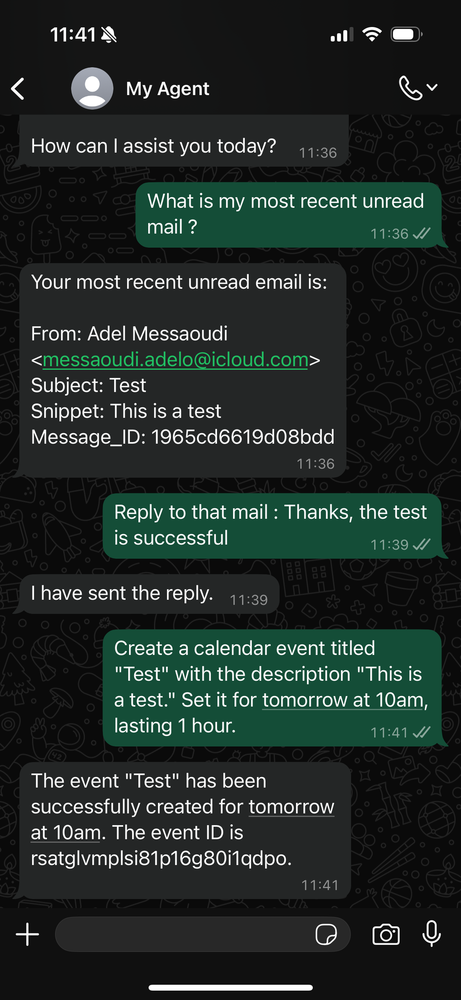
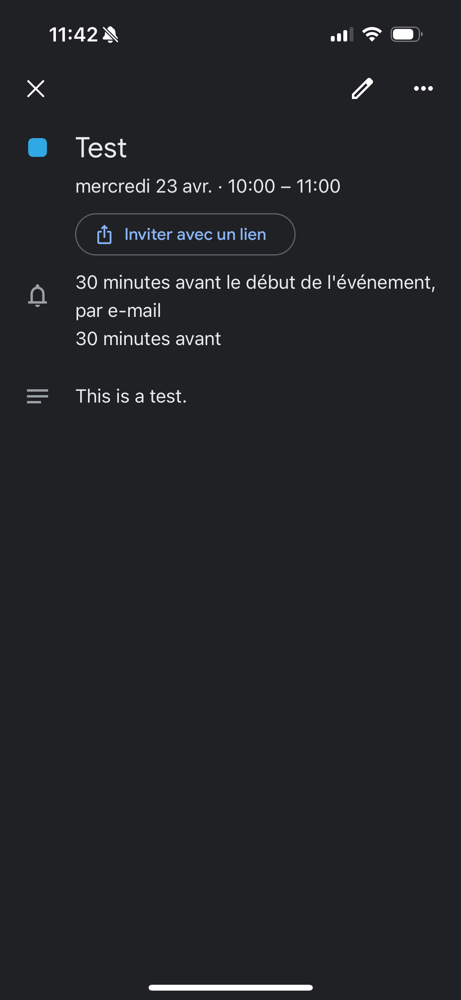

# 🤖 WhatsApp AI Agent with MCP Servers Gmail & Google Calendar

This project is a fully autonomous **conversational AI agent** that interacts via **WhatsApp**, interprets user requests using **Google Gemini**, and delegates actions to two dedicated **MCP Servers** for **Gmail** and **Google Calendar**.

Built with **n8n**, this modular architecture separates the core AI logic from service integrations, ensuring clarity, scalability, and reusability.

---

## 🧩 Overview

- 💬 Receives messages via WhatsApp
- 🧠 Maintains 20-message memory context
- 🔮 Generates responses with the Gemini model
- 📬 Gmail actions (via MCP Server): read, send, reply and mark as read or unread
- 📅 Calendar actions (via MCP Server): create, update, delete, view upcoming events
  
---

## 🗣️ Example Requests

### 💬 Conversation with the AI agent

| Agent introduction | Sample user requests |
|--------------------|----------------------|
|  |  |

---

### ✅ Action results

| Email inbox preview | Google Calendar confirmation |
|---------------------|------------------------------|
|  |  |

---

## 🛠️ Technologies Used

- **n8n** – Visual workflow automation (MCP Server / Client architecture)
- **Google Gemini** – LLM for natural language processing and generation
- **WhatsApp Cloud API** – Message input/output interface
- **Gmail API** – Email reading, sending, and marking
- **Google Calendar API** – Event management
- **MCP Server** – Modular services (Gmail & Calendar)

---

## 🚀 Setup Instructions

### 1. Import the workflows into n8n

Import the following files into your n8n instance:

- `agent_ia_core.json` – main workflow (AI agent using WhatsApp + Gemini)
- `mcp_gmail.json` – **MCP Server for Gmail** (read, send, mark emails)
- `mcp_google_calendar.json` – **MCP Server for Google Calendar** (create/update events)

### 2. Configure credentials

In each workflow, set up your credentials for:
- WhatsApp Business API
- Gmail OAuth2
- Google Calendar
- Gemini (PaLM)

### 3. Connect MCP Servers to the main AI agent

Each service (Gmail, Calendar) runs as a separate MCP Server.

To allow the main AI agent to delegate tasks to these servers, you must link them using `mcpClientTool` nodes inside the agent workflow.

#### 🔗 Steps to connect `mcpClientTool` nodes:

1. Open a **MCP Server workflow** (e.g. `mcp_gmail.json`)
2. Click on the `MCP Trigger` node (e.g. `MCP Server Gmail`)
3. Click **“Click to copy MCP URL”**
4. Open `agent_ia_core.json` and go to the corresponding `mcpClientTool` node (e.g. `MCP Gmail`)
5. Paste the URL into the **SSE Endpoint** field

🔁 Repeat for the other MCP Server (e.g., Calendar).

---

### 4. Activate the workflows (**in the right order**)

> ⛔ Do **not activate any workflow** before completing all setup steps  
✅ Activate them in this exact order to ensure all MCP Servers are properly running and ready before the main agent attempts to delegate any task.

1. First activate the MCP Server workflows:
   - `mcp_gmail.json`
   - `mcp_google_calendar.json`
2. Then activate the main AI agent workflow:
   - `agent_ia_core.json`

---

## 🧑‍💻 Author

📩 amessaoudi.am@gmail.com
🌍 https://github.com/AdelMessaoudi-13
